# Orthus

An ergonomic split keyboard PCB with an integrated capacitive trackpad, Sharp Memory Display, and speaker. Designed around Kailh Choc low-profile switches and styled after the Teenage Engineering OP-1.

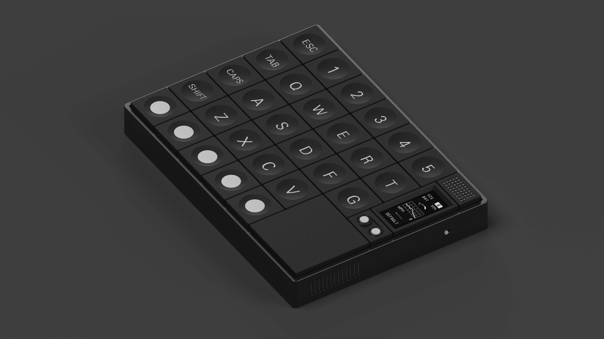

## Overview

Orthus is a 6×5 ortholinear split — two mirrored halves, one with the alpha cluster (`QWERT`/`ASDFG`/`ZXCV`) and a number row (`1`–`5`), the other with the right-hand alphas, symbols, and a numpad row. Each half carries:

- 30 Kailh Choc keys (5 columns × 5 rows of alpha + outer modifier column + bottom-row arrow/macro circles)
- An integrated **OrthusTrackpad** capacitive sensor zone
- A **Sharp Memory Display** for live status (signal, battery, WPM, layer)
- Two side encoders / buttons next to the display
- A speaker grille

Both halves side-by-side:

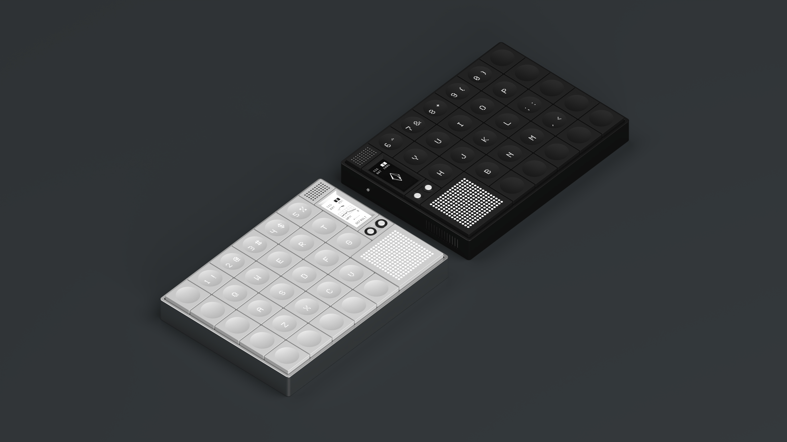

Top-down view of a single half:

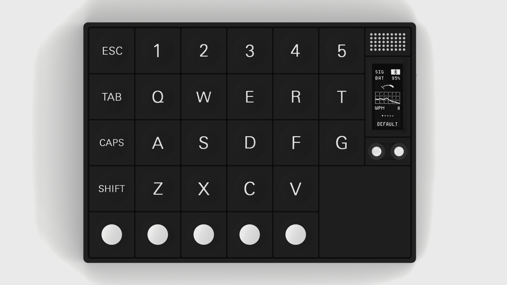

## Status

**Functionally complete** — finishing touches remain before fabrication (see "Known gaps" below).

## Folder layout

```
Orthus/
├── KiCad/              Main KiCad 7+ project — open Orthus.kicad_pro
│   ├── Orthus.kicad_pcb        Main board layout
│   ├── Orthus.kicad_sch        Top-level schematic (loads sub-sheets)
│   ├── Left.kicad_sch          Left-half hierarchical sheet
│   ├── Right.kicad_sch         Right-half hierarchical sheet
│   ├── LeftMatrix.kicad_sch    Switch matrix sub-sheet
│   ├── OLED.kicad_sch          Display sub-sheet
│   ├── led.kicad_sch / led_r.kicad_sch   LED sub-sheets
│   ├── font/                   Custom silkscreen font SVGs (digits 0–9)
│   └── backups/                Dated KiCad auto-backups
├── Renders/            Project renders, layout studies, and WIP photos
├── 3D/                 Mechanical models — case, keycaps, trackpad
│   ├── Orthus.step / .stl / .gltf / .bin     Full assembly
│   ├── OrthusSimple*.step                    Simplified assembly variants
│   ├── OrthusKeycap*.step                    Keycap variants (Alt, TLBR, TRBL)
│   ├── AltarCap v2/v3.step                   Sculpted altar-style keycaps
│   ├── OrthusTrackpad*.step                  Trackpad PCB models
│   └── TM040YDHG32.step                      LCD reference model
├── Fabrication/        Trackpad grill cutouts (.dxf / .svg, square + slotted)
├── JLCPCB/             Empty — gerbers for the main PCB not yet generated
└── Components/
    ├── OrthusTrackpad/    Capacitive trackpad PCB (self-contained KiCad project + gerbers)
    └── OrthusSharp/       Sharp Memory Display breakout (KiCad project + gerbers)
```

## Components

| Component | Purpose | Status |
|---|---|---|
| **OrthusTrackpad** | Custom mutual-capacitance trackpad PCB integrated into each half. Self-contained KiCad project with its own JLCPCB gerber output. | Complete |
| **OrthusSharp** | Sharp Memory Display breakout, derived from an open-source `sharp_memory_display` design and significantly modified. KiCad 5 originals preserved under `Components/OrthusSharp/Legacy/`. | Complete |
| **OrthusMouseWheel** | Scroll wheel module — *not included in this repo, still under `Custom/Ergomania/OrthusMouseWheel/`.* | Unfinished |

## Renders

| | |
|---|---|
| 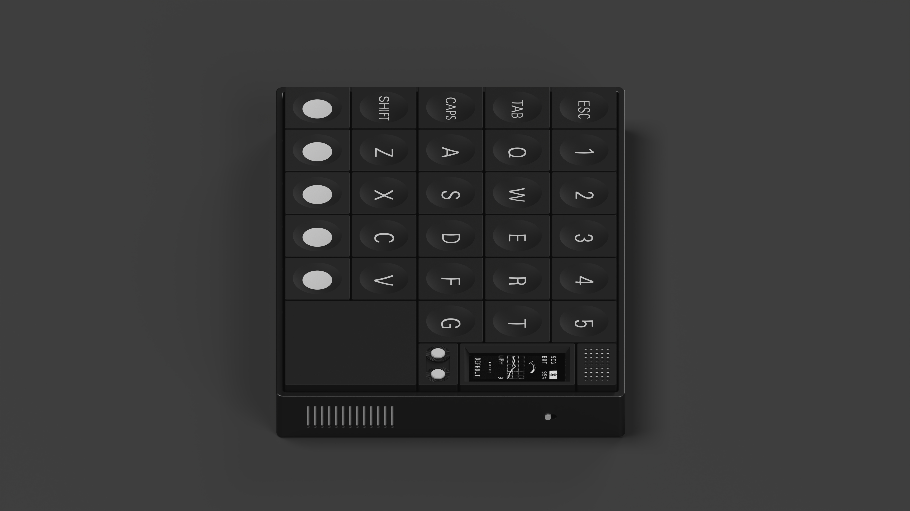 | 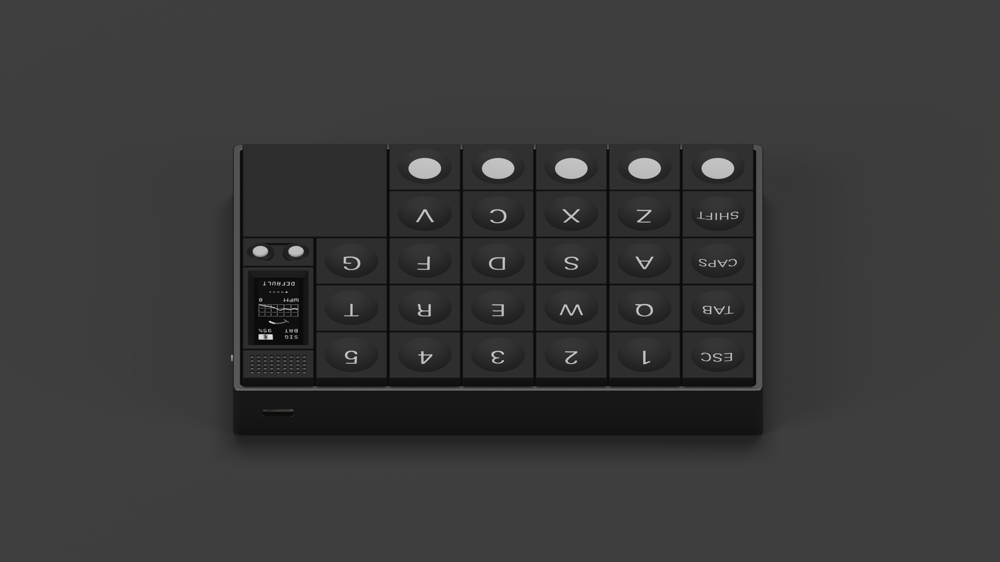 |
| 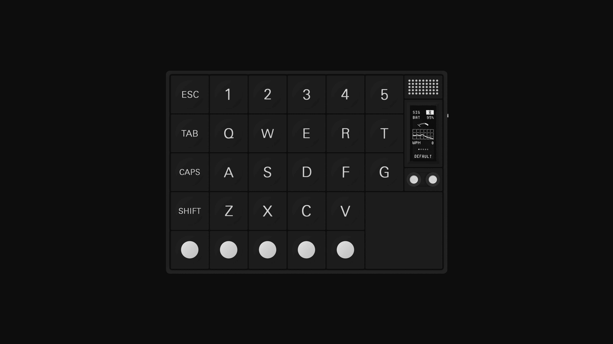 | 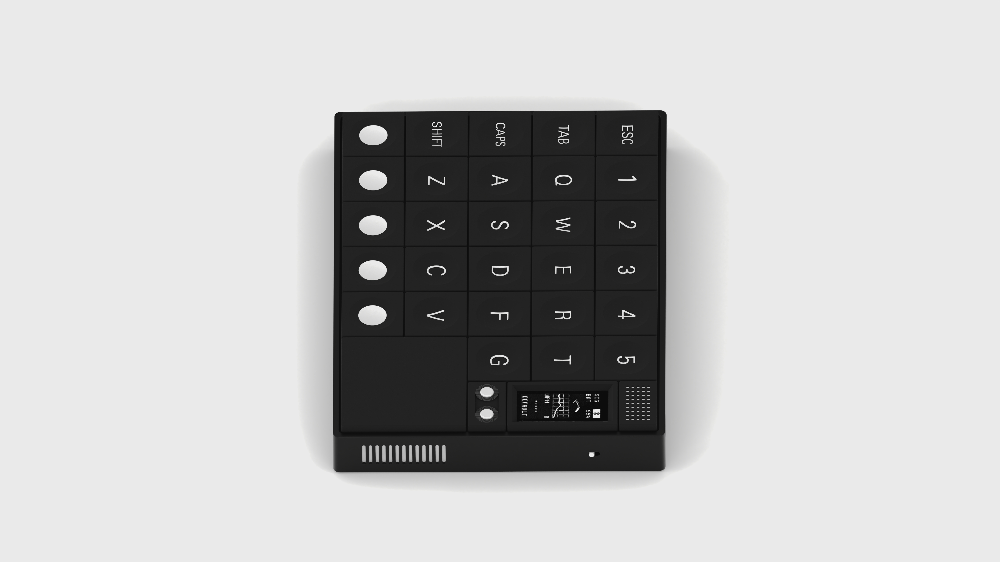 |
| 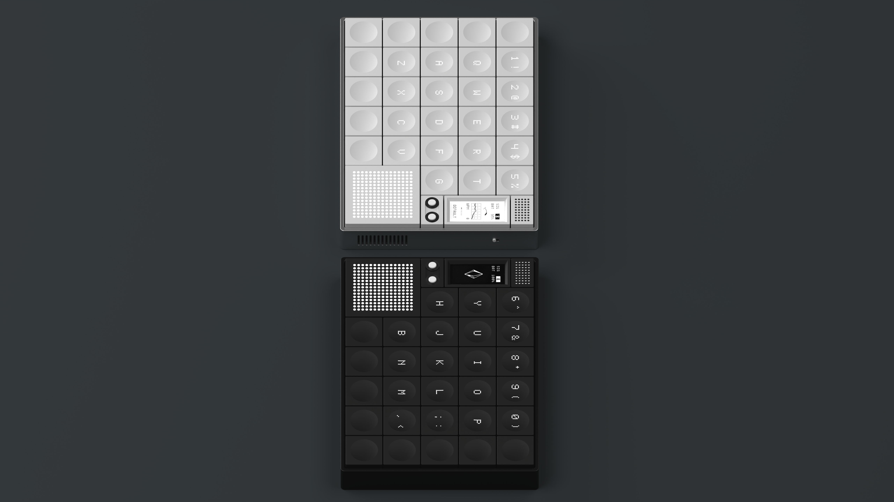 | 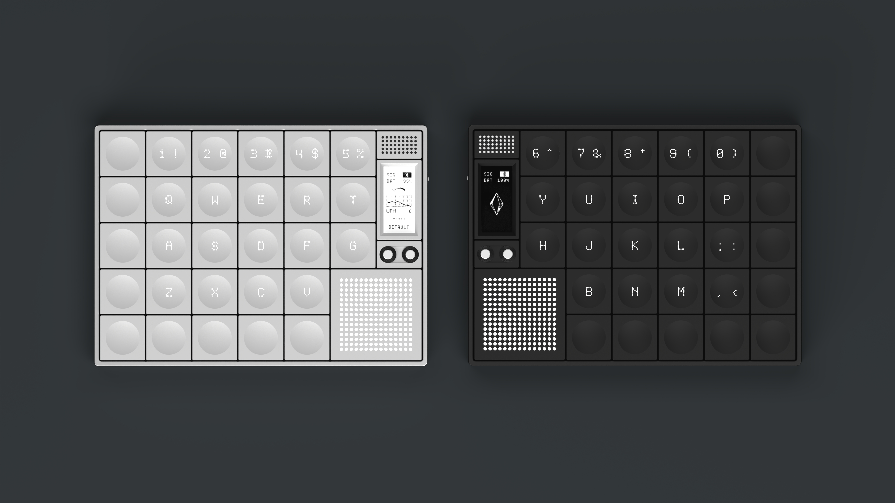 |

Layout studies and design exploration:

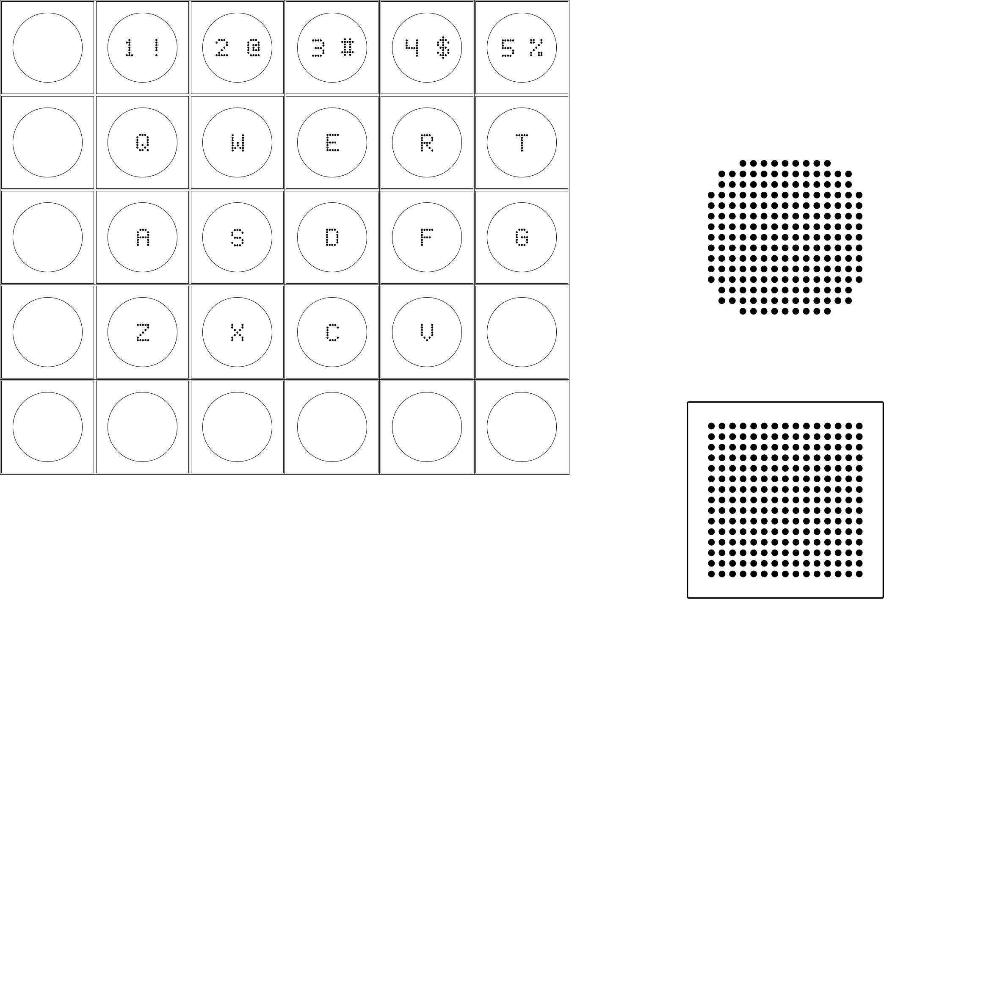

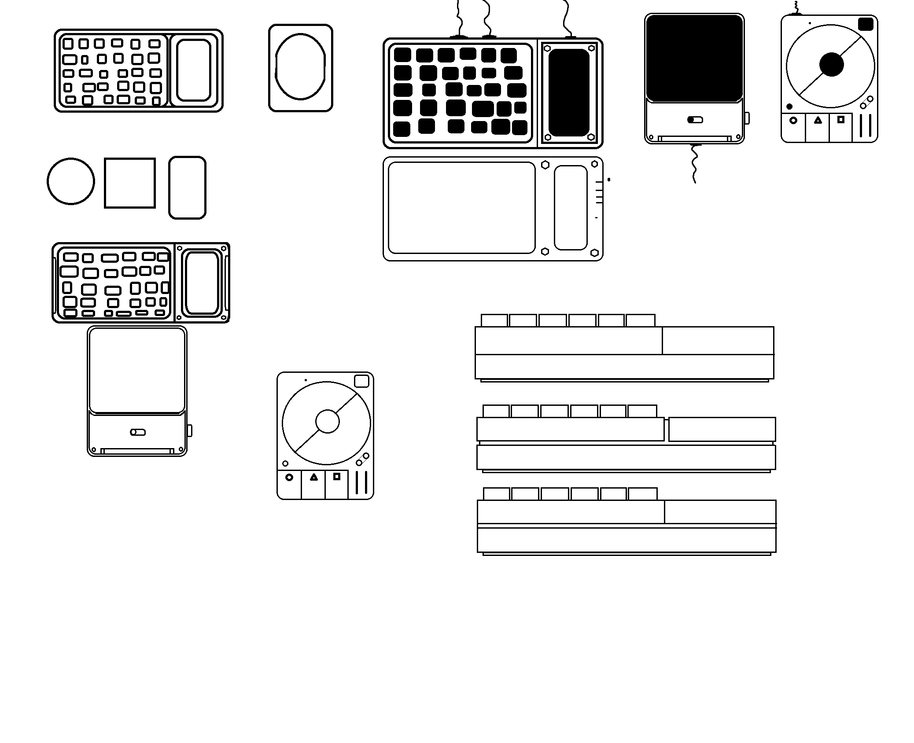

## Known gaps

- **No gerbers / JLCPCB order files** for the main Orthus PCB. `JLCPCB/` is an empty placeholder — gerbers need to be generated before fabrication.
- **No BOM / pick-and-place files** for the main PCB.
- **No assembly documentation** — refer to the hierarchical schematics under `KiCad/`.
- **3D model paths in `Orthus.kicad_pcb`** still reference absolute paths under `E:/EverythingKB/Custom/Ergomania/OrthusChoc/...`. The 3D viewer works locally because of this; for an open-source release these should be repointed at `Orthus/3D/`.
- **3D model path in `OrthusSharp.kicad_pro`** uses `../../Custom/Ergomania/test/OrthusSharp.step` (relative to its old location).
- **OrthusSharp `fp-lib-table`** carries hardcoded macOS paths (`/Users/karnadi/...`) inherited from the upstream fork — regenerate or repoint to your local KiCad libraries on first open.

## Attribution

`Components/OrthusSharp/` is derived from an open-source Sharp Memory Display breakout (see `Components/OrthusSharp/LICENSE`). Heavily modified for integration with Orthus.

## License

See [`LICENSE`](LICENSE).
